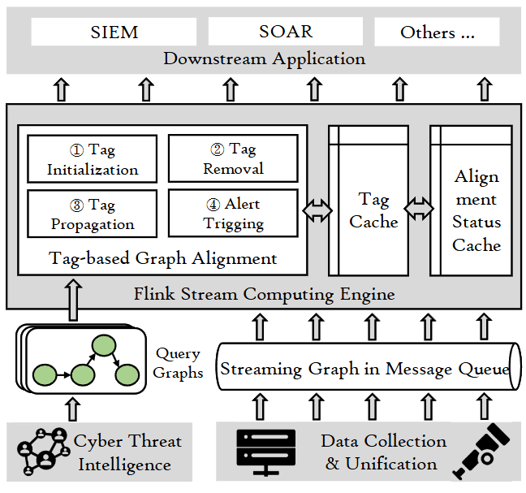

# MARLIN
This repository hosts MARLIN, an advanced provenance detection system that combines GraphAlignment-based and Anomaly path mining-based techniques for real-time threat detection.

MARLIN uses a tag propagation-based framework to perform efficient detection across complex network environments. By leveraging graph theory and machine learning algorithms, it can identify suspicious patterns and potential security breaches with high accuracy and minimal false positives.

We continuously develop and enhance MARLIN's capabilities to address evolving cybersecurity challenges in enterprise environments.☺️

## 🎉 Introduction

<p><a href="https://arxiv.org/abs/2403.12541"></a></p>

- Introduces MARLIN, an advanced provenance detection system that conceptualizes attack detection as a streaming graph alignment problem, combining GraphAlignment-based and Anomaly path mining-based techniques.

- Implements a tag propagation-based framework that efficiently processes streaming provenance graphs with minimal computational overhead, analyzing each event only once without needing to cache entire graphs.

- Utilizes query graphs with seeds and fuzzified matching conditions to detect both standard and mutated attack patterns, making it robust against evasion tactics like benign event insertion.

Our paper: [MARLIN: Knowledge-Driven Analysis of Provenance Graphs for Efficient and Robust Detection of Cyber Attacks](https://arxiv.org/abs/2403.12541)


## System Overview
<p align="center">



</p>

Marlin's architecture comprises three main components:
- `Flink Stream Computing Framework`: Pulls streaming log data from Kafka and transforms it into event triplets.
- `Query Graph Construction`: Builds corresponding query graphs by collecting attack reports from Drapa and incorporating TTPs constructed from MITRE ATT&CK.
- `Tag-based Graph Alignment`: Uses a four-stage tag process to align graph states, and employs a secondary indexing mechanism to update and preserve these states.

## Run MRALIN
We show how to run MARLIN in this section.
Firstly, please clone this repo first:
```bash
git clone https://github.com/MarineYY/MARLIN.git && cd src/main
```


### Dependencies

To run MARLIN you need to install IDEA. More detailed instructions on installing IDEA can be found at this [Link](https://www.jetbrains.com/idea/download/?section=windows).

Regarding the specific dependencies required for MARLIN installation, we use Maven for dependency management. The corresponding dependency versions can be found in the [pom.xml](src/main/pom.xml) file.

### Datasets

MARLIN is evaluated on open-source datasets from Darpa TC and ASAL.

### Execute
Execute this project by running the following command, or clicking the start button in IDEA.
```bash
javac src/main/java/libtagpropagation/main.java
java -cp src/main/java libtagpropagation.main
```

## Licensing
Distributed under the Apache License 2.0 License.
See `LICENSE` for more information.
The attack chains are for education, research, and testing purpose.
The author does not condone any illegal use.
Use as your own risk.

## Contributing
We welcome all feedback and contributions. If you wish to file a bug or enhancement proposal or have other questions, please use the Github Issue. If you'd like to contribute code, please open a Pull Request.