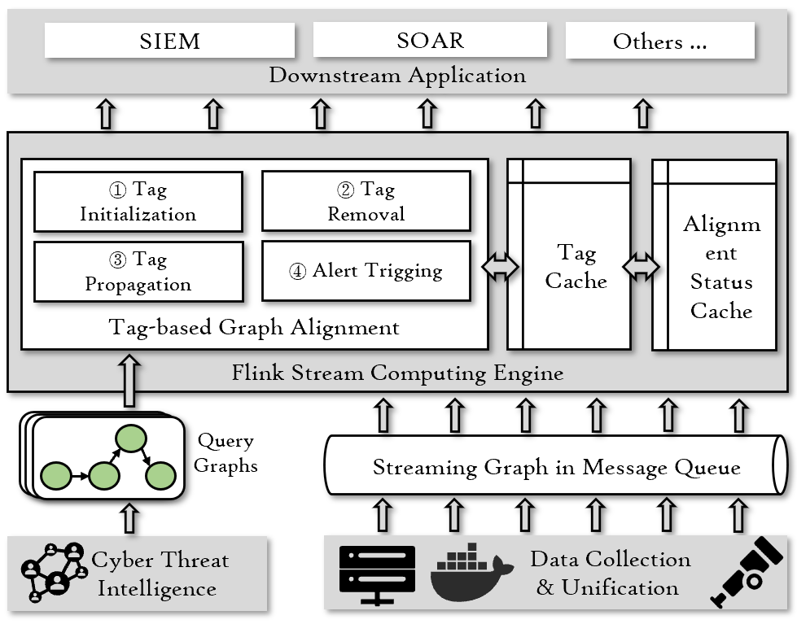

# MARLIN

Welcome to the MARLIN repository. 

## System Overview

## Prerequisites

### Prepare Environment
1. ***Development tools***: To run MARLIN you need to install IDEA. More detailed instructions on installing IDEA can be found at this [Link](https://www.jetbrains.com/idea/download/?section=windows).
2. ***Configure dependencies***: The following are mainly sets, more detailed information are found in <u>pom.xml</u>.  

### Prepare Data Stream
MARLIN is evaluated on open-source datasets from Darpa and ASAL. We open the log parsing source code to the public in another repository.  You can access it using the following [Link](https://github.com/MarineYY/DarpaASALLogParser.git).

## Evaluation
### Start Kafka Topic 
`bin/kafka-console-producer.sh --broker-list ip:port --topic test`
### Start MARLIN
`java main.java`
### Send Data Stream
`java xxxLogPackProducer.java`